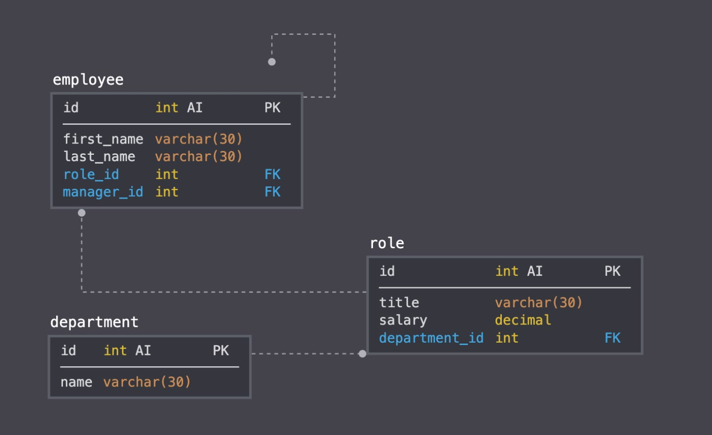

# MySQL — Employee Tracker

## Description

A command-line application for managing a company's employees .


## User Story

As a business owner，
I want to be able to view and manage the departments, roles, and employees in my company，So that I can organize and plan my business。

 
## Table of Contents


* [Usage](#usage)
* [Installation](#installation)
* [Required Dependencies](#dependencies)
* [Helpful Dependencies](#dependencies)
* [Technologies](#technologies)
* [Tests](#tests)
* [Fun](#fun)
* [Challenges](#challenges)
* [Finished Product](#finished-product)
* [Questions](#questions)
* [Learn More](#learn-more)


## Usage

```
When I open this command-line application, it allows me to:

1: Add departments, roles, employees.
2: View departments, roles, employees.
3: Update employee roles.

```


## **Installation**

Node.js : https://nodejs.org/en/

MySQL Workbench (If you are a new user of MySQL, download at): https://dev.mysql.com/downloads/workbench/

Init and Install npm : https://www.npmjs.com/get-npm


## **Required Dependencies**

InquirerJs npm package (by running ``` npm install inquerer ```)

MySQL npm package (by running ``` npm install mysql ``` )


## **Helpful Dependencies**

Nodemon (by running ``` npm install nodemon -g ``` )

Figlet (by running ``` npm install figlet ``` )


## Technologies

* NodeJS (brings javascript environment)

* Inquirer.JS (interact with the user via the command-line)

* MySQL Workbentch (backEnd database and perform queries)


## Testes

Test application by running ``` node app.js ``` inside the Terminal.


## Fun

``` MySQL ``` is new to everyone in the class, it was fun to set it up and try it out.


##  Challenges

Creating ``` console.table ``` , but I coded along in class with my teacher, and coded same fucntion over and over again instead of copy and paste, that helped a lot.


## Finished Product




## Questions

If you have any further questions, please contact me:

GitHub:https://github.com/Jamly-Miller

LinkedIn: https://www.linkedin.com/in/jamly-miller-125307200/


## Learn More